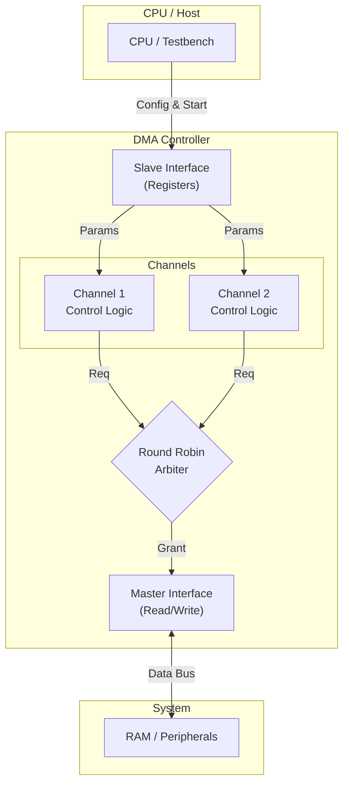

# 2-Channel DMA Controller

This repository contains the Register Transfer Level (RTL) design and verification environment for a **2-Channel Direct Memory Access (DMA) Controller**.
## Architecture Diagram

## Project Description

A DMA controller is a fundamental hardware component in modern computing systems, designed to enable peripheral devices (such as network interfaces or storage controllers) to transfer data directly to or from the main memory. This capability is critical for maximizing system performance by offloading the data movement tasks from the Central Processing Unit (CPU), allowing the CPU to execute application code concurrently.

This specific design implements a **dual-channel** architecture, capable of managing two independent data transfer streams simultaneously.

### Key Features:

* **Dual Channel Operation:** Provides two distinct and concurrent transfer paths for simultaneous data transactions.

* **Simple AHB-like Interface:** Designed to interface with memory and peripherals using a simplified bus protocol for address, control, and data transfer.

* **Register-Based Programming:** Transfer parameters, including source address, destination address, and the total length of the transfer, are configured by the CPU writing to dedicated control registers.

* **Interrupt Signaling:** Generates an interrupt to the CPU upon the successful completion of a programmed transfer, signaling that the data is ready.

## Repository Structure

The project files are organized to separate the core hardware design from the verification test environment.

| **Directory/File** | **Description** |
| :--- | :--- |
| `src/` | Contains the **Verilog** source files for the DMA Controller RTL design. |
| `test/` | Contains the **Verilog** testbench (`dma_controller_tb.v`) used to verify the functional correctness of the DMA Controller. |
| `README.md` | This file, providing project overview and instructions. |

## Simulation and Implementation Instructions

The design can be simulated using standard EDA tools or implemented using an FPGA vendor's toolchain.

### 1. Running on EDA Playground (Simulation)

EDA Playground offers a quick, browser-based solution for simulating the Verilog design.

**Steps:**

1. **Code Transfer:** Copy the contents of the Verilog files from the `src/` directory (RTL code) and the `test/dma_controller_tb.v` file (Testbench code) into the appropriate file tabs on the EDA Playground website.

2. **Language Selection:** Ensure the chosen language is **Verilog**.

3. **Tool Selection:** Under **Tools & Simulators**, select a suitable simulator, such as **Synopsys VCS 2023.03**.

4. **Configuration:**

   * **Compile Options:** A standard setting is `-timescale=1ns/1ns +vcs+flush+all`.

   * **Run Options:** A standard setting is `-debug_access+all`.

   * Ensure the checkbox for **Open EPWave after run** is checked to enable viewing of the simulation waveforms.

5. **Execution:** Click the **Run** button to compile the design and execute the testbench. The simulation output will be displayed in the console, and the waveforms will load in the EPWave viewer for detailed signal analysis.

### 2. Running on Xilinx Vivado (Simulation and Synthesis)

Vivado is the recommended environment for formal synthesis and hardware targeting (e.g., Xilinx FPGAs).

**Steps:**

1. **Create Project:** Launch Vivado and create a new **RTL Project**. Specify the project name and location.

2. **Add Design Sources:** In the **Add Sources** wizard step, select **Add or Create Design Sources** and include all Verilog files from the local `src/` directory.

3. **Add Simulation Sources:** In the same wizard, select **Add or Create Simulation Sources** and include the testbench file (`dma_controller_tb.v`) from the `test/` directory.

4. **Select Device:** Choose the target FPGA device for your project (e.g., an Artix-7 or Kintex-7 device).

5. **Run Behavioral Simulation:**

   * In the **Flow Navigator** pane, navigate to **Simulation**.

   * Select **Run Simulation** -> **Run Behavioral Simulation**.

   * Vivado will compile the RTL and the testbench, and the **Waveform Viewer** will open. Examine the waveforms to verify that the DMA channels correctly perform the memory transfers as defined by the testbench.

6. **Synthesis and Implementation:** If you wish to synthesize the design, use the **Run Synthesis** and **Run Implementation** flows within the Flow Navigator.

## Licensing

This project is licensed under the MIT License
