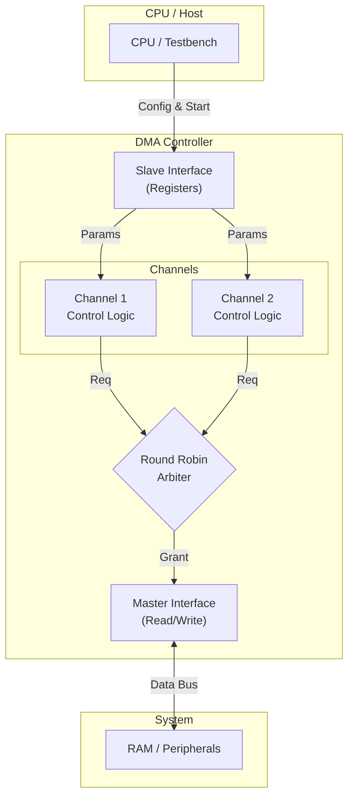

# 2-Channel DMA Controller

This repository contains the Register Transfer Level (RTL) design and verification environment for a **2-Channel Direct Memory Access (DMA) Controller**. It features a custom Round-Robin Arbiter to manage simultaneous data transfer streams, optimized for low-resource FPGA implementations.

## Architecture Diagram

## Implementation Stats
Synthesized on Xilinx Vivado (Target: Zynq-7000 / Artix-7 Fabric):

| Resource | Count | Utilization |
| :--- | :--- | :--- |
| **Slice LUTs** | 479 | <1% |
| **Registers (FF)** | 492 | <1% |
| **Max Frequency** | 100 MHz (constrained) | - |

## Key Features

* **Dual Channel Operation:** Manages two distinct transfer paths with independent configuration registers.
* **Round-Robin Arbitration:** Ensures fair bandwidth allocation between channels when both request access simultaneously.
* **Simplified AHB-like Interface:** Uses a lightweight handshake protocol (Address, Control, Data) for easy integration with custom memory subsystems.
* **Register-Based Programming:** Fully software-configurable Source/Destination addresses and Transfer Lengths.
* **Interrupt Signaling:** Generates distinct interrupts upon transfer completion, reducing CPU polling overhead.

## Repository Structure

The project follows a standard verification structure:

| **Directory/File** | **Description** |
| :--- | :--- |
| `src/` | Contains the **SystemVerilog** source files (RTL Design). |
| `test/` | Contains the testbench (`dma_controller_tb.v`) covering basic transfers and arbitration logic. |
| `README.md` | Project documentation. |

## Simulation and Usage

### 1. Quick Start (EDA Playground)
You can simulate this design instantly in your browser without installing software.

**[Click here to Run on EDA Playground](INSERT_YOUR_SAVED_PLAYGROUND_LINK_HERE)**

*If running manually:*
1.  Copy code from `src/` and `test/`.
2.  Select **Synopsys VCS 2023.03**.
3.  Add flags: `-timescale=1ns/1ns +vcs+flush+all -debug_access+all`.
4.  Run and view waves in EPWave.

### 2. Xilinx Vivado (Simulation & Synthesis)
Recommended for formal verification and synthesis analysis.

1.  **Create Project:** New RTL Project -> Target Artix-7 or Kintex-7.
2.  **Add Sources:** Add `src/` files as Design Sources and `test/` files as Simulation Sources.
3.  **Run Simulation:** Go to *Flow Navigator -> Simulation -> Run Behavioral Simulation*.
4.  **View Waveforms:** Observe the `req` and `grant` signals in the Arbiter to see the channel switching in action.

## Licensing

This project is licensed under the MIT License
